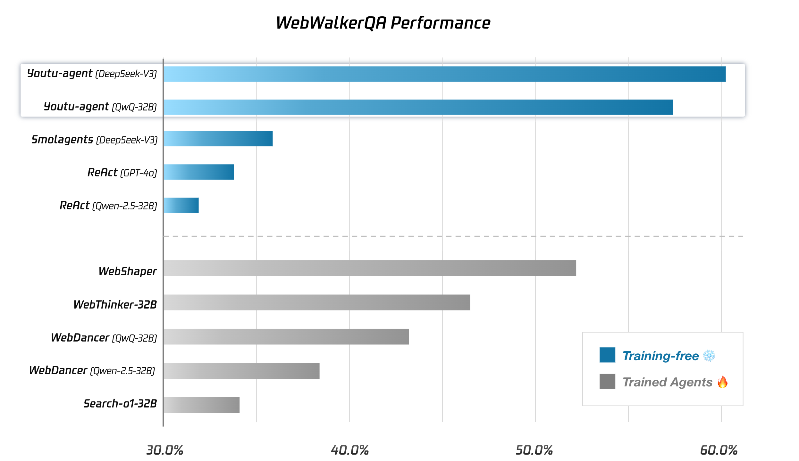

#  Youtu-Agent: 一个简单强大的智能体框架

<div align="center">
<a href="https://tencentcloudadp.github.io/youtu-agent/"></a>
<!-- <a href=https://arxiv.org/abs/2502.14345></a> -->
<a href=https://github.com/TencentCloudADP/youtu-agent></a>
<a href=https://deepwiki.com/TencentCloudADP/youtu-agent></a>
</div>

<p align="center">
| <a href="README.md"><b>English</b></a>
| <a href="#-基准性能"><b>🌟 性能</b></a> 
| <a href="#-示例"><b>💡 示例</b> </a> 
| <a href="#-特性"><b>✨ 特性</b> </a> 
| <a href="#-快速开始"><b>🚀 快速开始</b> </a> 
| 
</p>


`Youtu-Agent` 是一个灵活、高性能的框架，用于构建、运行和评估自主智能体。除了在基准测试中名列前茅，该框架还提供了强大的智能体能力，采用开源模型即可实现例如数据分析、文件处理、深度研究等功能。


主要亮点：
- **验证性能**：在 WebWalkerQA 上达到 71.47% 的 pass@1，在 GAIA（纯文本子集）上达到 72.8% 的 pass@1，纯粹使用 `DeepSeek-V3` 系列模型（不使用 Claude 或 GPT），建立了强大的开源起点。
- **开源友好且成本敏感**：针对可访问、低成本部署进行了优化，不依赖封闭模型。
- **实际用例**：开箱即用地支持 CSV 分析、文献综述、个人文件整理以及播客和视频生成等任务。（即将推出）
- **灵活的架构**：基于 [openai-agents](https://github.com/openai/openai-agents-python) 构建，可兼容各种模型 API（从 `DeepSeek` 到 `gpt-oss`）、工具集成和框架实现。
- **自动化与简洁性**：基于 YAML 的配置、自动智能体生成和简化的设置减少了手动开销。

## 🗞️ 新闻

- 🎁 [2025-09-02] [腾讯云国际站](https://www.tencentcloud.com/) 为 DeepSeek API 新用户提供 **300 万免费令牌**（**2025年9月1日 – 2025年10月31日**）。如果想在 `Youtu-Agent` 中使用 DeepSeek 模型，[点击免费试用](https://www.tencentcloud.com/document/product/1255/70381)！如需企业级智能体解决方案，也可查看 [智能体开发平台 ADP](https://adp.tencentcloud.com)。
- 📺 [2025-08-28] 我们围绕新发布的 DeepSeek-V3.1 模型进行了直播分享，并介绍了如何在 `Youtu-Agent` 框架中使用该模型。[点击这里](https://doc.weixin.qq.com/doc/w3_AcMATAZtAPICNvcLaY5FvTOuo7MwF) 获取所用文档。

## 🌟 基准性能

`Youtu-Agent` 基于开源模型和轻量级工具构建，在具有挑战性的深度搜索和工具使用基准测试中表现出色。

- **[WebWalkerQA](https://huggingface.co/datasets/callanwu/WebWalkerQA)**：使用 `DeepSeek-V3-0324` 实现了 60.71% 的准确率，使用新发布的 `DeepSeek-V3.1` 可进一步提升至 71.47%，创造了新的 SOTA 性能。
- **[GAIA](https://gaia-benchmark-leaderboard.hf.space/)**：使用 `DeepSeek-V3-0324`（包括工具中使用的模型）在[纯文本验证子集](https://github.com/sunnynexus/WebThinker?tab=readme-ov-file#benchmarks)上实现了 72.8% 的 pass@1。我们正在积极扩展对带有多模态工具的完整 GAIA 基准的评估，将在近期放出完整轨迹，敬请关注！✨



## 💡 使用示例

<table border="1" style="border-collapse: collapse;">
  <tr>
    <td style="border: 1px solid black; padding: 10px;">
      <a href="https://www.youtube.com/watch?v=r9we4m1cB6M">
        
      </a>
      <br><strong>数据分析</strong><br>分析 CSV 文件并生成 HTML 报告。
    </td>
    <td style="border: 1px solid black; padding: 10px;">
      <a href="https://www.youtube.com/watch?v=GdA4AapE2L4">
        
      </a>
      <br><strong>文件管理</strong><br>为用户重命名和分类本地文件。
    </td>
  </tr>
  <tr>
    <td style="border: 1px solid black; padding: 10px;">
      <a href="https://www.youtube.com/watch?v=vBddCjjRk00">
        
      </a>
      <br><strong>广度研究</strong><br>收集大量信息以生成综合报告，复刻 Manus 的功能。
    </td>
    <td style="border: 1px solid black; padding: 10px;">
      <a href="https://www.youtube.com/watch?v=v3QQg0WAnPs">
        
      </a>
      <br><strong>论文分析</strong><br>解析给定论文，进行分析，并整理相关文献以得出最终结果。
    </td>
  </tr>
</table>

### 🤖 自动智能体生成

`Youtu-Agent`的突出优势在于其**自动化生成智能体及其配置**的能力。在其他框架中，定义特定任务的智能体通常需要编写代码或是精心设计提示词，而`Youtu-Agent`采用基于 YAML 的简洁配置方案，实现了高效自动化：内置的“元智能体”与用户对话并捕获需求，然后自动生成并保存配置。

```bash
# Interactively clarify your requirements and auto-generate a config
python scripts/gen_simple_agent.py

# Run the generated config
python scripts/cli_chat.py --stream --config generated/xxx
```

<table border="1" style="border-collapse: collapse;">
  <tr>
    <td style="border: 1px solid black; width:420px; padding:10px; vertical-align:top;">
      <a href="https://www.youtube.com/watch?v=JVpHDJtKBo8">
        
      </a>
      <br><strong>自动智能体生成</strong><br>交互式对话的方式捕获需求，自动生成agent配置，并立即运行。
    </td>
  </tr>
</table>


更详细的示例和高级用例，请参阅 [`examples`](./examples) 目录和我们的文档 [`docs/examples.md`](./docs/examples.md)。

## ✨ 特性


### 设计理念
- 极简设计：这确保了框架的精简，避免了不必要的开销。
- 模块化与可配置：这允许灵活的定制和新组件的轻松集成。
- 开源模型支持与低成本：这促进了各种应用的可访问性和成本效益。

### 核心功能
- 基于openai-agents构建：利用 [openai-agents](https://github.com/openai/openai-agents-python) SDK 作为基础，我们的框架继承了 streaming、tracing 和 agent-loop 能力，确保了与 `responses` 和 `chat.completions` API 的兼容性，无缝适应 [gpt-oss](https://github.com/openai/gpt-oss) 等多样化模型。
- 完全异步：这实现了高性能和高效执行，尤其有利于高效的评估。
- 追踪与分析系统：除了 OTEL，我们的 `DBTracingProcessor` 系统提供了对工具调用和智能体轨迹的深入分析。（即将发布）

### 自动化
- 基于 YAML 的配置：这允许结构化且易于管理的智能体配置。
- 自动智能体生成：根据用户需求，可以自动生成智能体配置。
- 工具生成与优化：工具评估和自动化优化，定制化工具生成的能力将在未来得到支持。

### 用例
- 深度/广度研究：涵盖常见的面向搜索的任务。
- 网页生成：示例包括根据特定输入生成网页。
- 轨迹收集：支持用于训练和研究目的的数据收集。

## 🤔 为何选择 Youtu-Agent？

`Youtu-Agent` 旨在为不同的用户群体提供价值：

### 对于智能体研究人员和大型语言模型训练师
- 一个**简单而强大的基线**，比基本的 ReAct 更强大，可作为模型训练和消融研究的绝佳起点。
- **一键评估脚本**用以简化实验过程，并确保一致的基准测试。

### 对于智能体应用开发者
- 一个**经过验证且可移植的脚手架**，用于构建真实的智能体应用程序。
- **易于使用**：通过简单的脚本和丰富的内置工具包快速上手。
- **模块化设计**：`Environment` 和 `ContextManager` 等关键组件被封装，但高度可定制。

### 对于人工智能和智能体爱好者
- **实际用例**：`/examples` 目录包含深度研究报告生成、数据分析和个人文件整理等任务。
- **简单性与可调试性**：丰富的工具集和可视化追踪工具使开发和调试直观而直接。

## 🧩 核心概念

- **智能体（Agent）**：一个配置了提示词、工具和环境的大语言模型。
- **工具包（Toolkit）**：智能体可以使用的封装工具集。
- **环境（Environment）**：智能体操作的世界（例如，浏览器、shell）。
- **上下文管理器（ContextManager）**：一个可配置模块，用于管理智能体的上下文窗口。
- **基准（Benchmark）**：一个针对特定数据集的封装工作流，包括预处理、执行和判断逻辑。

更多的设计与实现细节，请参阅我们的[在线文档](https://tencentcloudadp.github.io/youtu-agent/)。

## 🚀 快速上手

Youtu-Agent 提供了完整的代码与示例，帮助你快速开始使用。按照以下步骤即可运行你的第一个智能体，或者参考 [`docker/README.md`](./docker/README.md) 使用Docker快速运行一个带交互网页的样例.

### 环境准备

### 源代码部署

> [!NOTE]
> 本项目使用 **Python 3.12+**。推荐使用 [uv](https://github.com/astral-sh/uv) 进行依赖管理。

首先请确保已在环境安装 Python 和 uv，接着参考以下步骤克隆本项目并同步项目依赖。

```bash
git clone https://github.com/TencentCloudADP/youtu-agent.git
cd youtu-agent
uv sync
source ./.venv/bin/activate
cp .env.example .env  # NOTE: 你需要配置相关环境变量!
```

复制 `.env.example` 文件后，参考以下 `.env` 文件配置，填写 LLM API。

```bash
# llm API 需兼容 OpenAI API 格式
# 配置你的 LLM , 可参考 https://api-docs.deepseek.com/
UTU_LLM_TYPE=chat.completions
UTU_LLM_MODEL=deepseek-chat
UTU_LLM_BASE_URL=https://api.deepseek.com/v1
UTU_LLM_API_KEY=<替换为你的 API Key>
```

> 腾讯云为新用户提供免费 DeepSeek API 额度。点击[此处](https://lke.cloud.tencent.com/lke/#/trialProduct?source=act)申请，完成后请参考以下 `.env` 文件配置。如果赠送额度已失效，可以点击[此处](https://buy.cloud.tencent.com/tcadp)购买额度包，或前往[系统管理设置页](https://console.cloud.tencent.com/lkeap/settings)启用“原子能力_DeepSeek API”后付费以激活 API Key：

```bash
# 设置你的 LLM 配置, 可参考 https://www.tencentcloud.com/document/product/1255/70381
UTU_LLM_TYPE=chat.completions
UTU_LLM_MODEL=deepseek-v3
UTU_LLM_BASE_URL=https://api.lkeap.cloud.tencent.com/v1
UTU_LLM_API_KEY=<替换为你的 API Key>
```

### Docker 部署

请参阅 [docker/README.md](https://github.com/TencentCloudADP/youtu-agent/blob/main/docker/README.md) 了解如何通过 Docker 一键部署带有交互网页的 Youtu-Agent。

### 快速开始

Youtu-Agent 内置了配置文件。例如，默认配置文件 (`configs/agents/default.yaml`) 定义了一个带有搜索工具的简单 Agent：

```yaml
defaults:
  - /model/base
  - /tools/search@toolkits.search
  - _self_

agent:
  name: simple-tool-agent
  instructions: "You are a helpful assistant that can search the web."
```

你可以通过以下命令启动交互式 CLI 聊天机器人：

```bash
# NOTE: 你需要在 .env 中配置 `SERPER_API_KEY` 和 `JINA_API_KEY` (我们计划在未来替换为免费工具)
python scripts/cli_chat.py --stream --config default
# 如果你不想使用搜索工具，可以运行
python scripts/cli_chat.py --stream --config base
```

📖 更多内容请参考：[快速开始文档](https://tencentcloudadp.github.io/youtu-agent/quickstart)

### 示例探索

本仓库提供了多个可直接运行的示例。某些示例要求 Agent 具备联网搜索功能，因此需要在 tools 模块下的 `.env` 文件中配置工具 API：

```bash
# tools
# serper api key, ref https://serper.dev/playground
SERPER_API_KEY=<Access the URL in the comments to get the API Key>
# jina api key, ref https://jina.ai/reader
JINA_API_KEY=<Access the URL in the comments to get the API Key>
```

例如希望Agent围绕"DeepSeek V3.1 新特性"主题，自动联网检索信息并生成SVG介绍图片，可以直接运行下面的代码：

```bash
python examples/svg_generator/main_web.py
```

如果想要借助 web-ui 以可视化方式预览 Agent 的运行情况，你可以在 Youtu-Agent 的 [releases](https:////github.com/Tencent/Youtu-agent/releases/tag/frontend%2Fv0.1.5) 中下载前端 ui 的打包文件并安装到本地：

```bash
# fetch and download the frontend package
curl -LO https://github.com/Tencent/Youtu-agent/releases/download/frontend%2Fv0.1.5/utu_agent_ui-0.1.5-py3-none-any.whl

# install frontend package
uv pip install utu_agent_ui-0.1.5-py3-none-any.whl
```

然后运行web版本的SVG图片生成命令：

```bash
python examples/svg_generator/main_web.py
```

当终端出现以下提示时，说明部署成功。点击本地链接访问项目：

```bash
Server started at http://127.0.0.1:8848/
```


给定一个研究主题后，Agent 会自动执行网络搜索，收集相关信息，并输出一张 SVG 可视化图。


📖 更多示例请参考：[示例文档](https://tencentcloudadp.github.io/youtu-agent/examples)

### 运行评测

Youtu-agent 还支持在标准数据集上进行基准测试。例如，在 **WebWalkerQA** 上运行评测：

```bash
# 数据集预处理. 该脚本会下载并处理 WebWalkerQA 数据集，然后保存到数据库中。
python scripts/data/process_web_walker_qa.py

# 使用配置 ww.yaml 运行评测. 我们选择采样小数据集 WebWalkerQA_15 用于快速评测。
# NOTE: 需要在 `.env` 中配置 `JUDGE_LLM_TYPE, JUDGE_LLM_MODEL, JUDGE_LLM_BASE_URL, JUDGE_LLM_API_KEY`，参考 `.env.full`。
python scripts/run_eval.py --config_name ww --exp_id <your_exp_id> --dataset WebWalkerQA_15 --concurrency 5
```

结果会保存到本地，并可在分析平台中进一步查看。详见 [评测分析](./frontend/exp_analysis/README.md)。


📖 更多内容请参考：[评测文档](https://tencentcloudadp.github.io/youtu-agent/eval)

## 📖 深入了解

快速上手之后，您可以通过我们的完整文档深入了解框架及其功能：

- 📖 **[完整文档](https://tencentcloudadp.github.io/youtu-agent/)**: 探索核心概念、架构和高级功能。
- 🚀 **[快速入门指南](https://tencentcloudadp.github.io/youtu-agent/quickstart/)**: 详细的入门指南，助您快速启动和运行。
- ❓ **[常见问题解答](https://tencentcloudadp.github.io/youtu-agent/faq)**: 查找常见问题与解答。

## 🙏 致谢

本项目基于以下优秀开源项目：
- [openai-agents](https://github.com/openai/openai-agents-python)
- [mkdocs-material](https://github.com/squidfunk/mkdocs-material)
- [model-context-protocol](https://github.com/modelcontextprotocol/python-sdk)

## 🙌 参与贡献

我们欢迎来自社区的贡献！如果您希望帮助改进 Youtu-Agent，请阅读我们的 [**贡献指南**](./CONTRIBUTING.md) 开始。

## 📚 引用

如果您觉得这项工作有帮助，请考虑引用：

```bibtex
@misc{youtu-agent-2025,
  title={Youtu-agent: A Simple yet Powerful Agent Framework},
  author={Tencent Youtu Lab},
  year={2025},
  publisher = {GitHub},
  journal = {GitHub repository},
  howpublished = {\url{https://github.com/TencentCloudADP/youtu-agent}},
}
```

## ⭐ Star History


