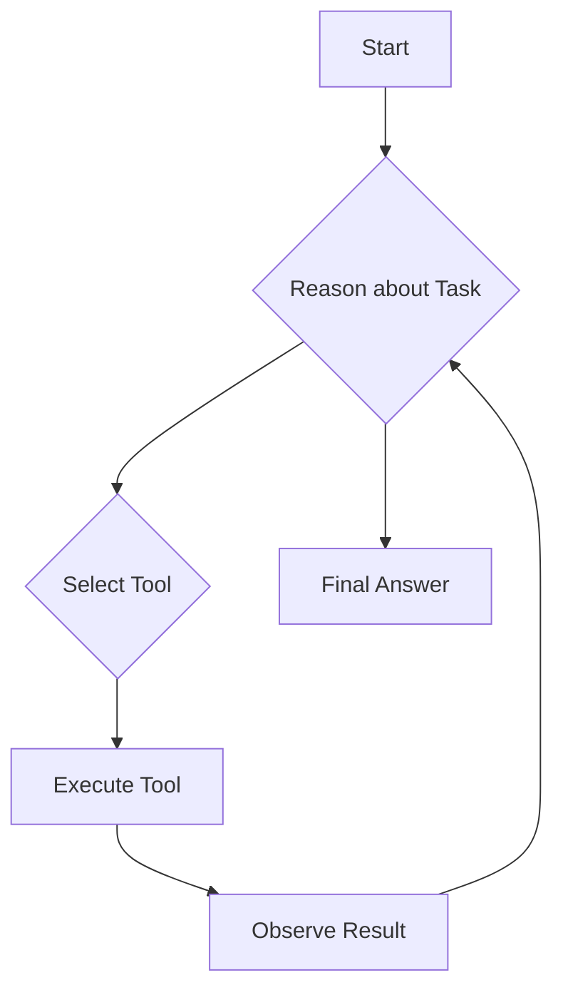
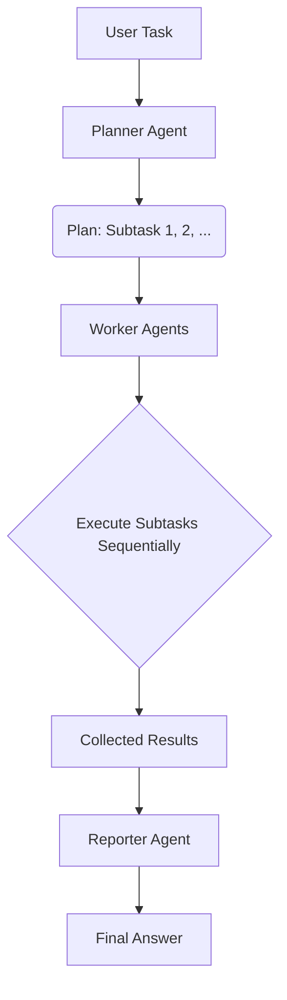

# Agent Paradigms

The framework provides two distinct agent paradigms to handle tasks of varying complexity: a straightforward `SimpleAgent` and a more advanced `OrchestraAgent`. The choice of paradigm is determined by the `type` field in the `AgentConfig`.

The `get_agent` factory function is the primary entry point for creating an agent instance based on the specified configuration.

```python
from utu.agents import get_agent
from utu.config import ConfigLoader

# Load a config file where type is set to "simple" or "orchestra"
config = ConfigLoader.load_agent_config("my_agent_config")

# The factory returns the correct agent instance
agent = get_agent(config)
```

---

## `SimpleAgent` (Single-Agent Paradigm)

`SimpleAgent` implements a classic, single-agent approach based on the Reason-Act (ReAct) framework.

### How it Works

A single LLM is responsible for the entire task-solving process. It operates in a loop:

1. **Reason**: The agent analyzes the current task and its context.
2. **Act**: Based on its reasoning, it selects and invokes an appropriate tool.
3. **Observe**: It observes the result from the tool and incorporates the new information into its context.

This loop continues until the agent determines that the task is complete and generates a final answer.



### Use Case

This paradigm is best suited for straightforward tasks that can be solved by a linear sequence of tool calls and do not require complex, long-term planning or the coordination of different specialized skills.

### Usage Examples

Here are a few examples of how to use `SimpleAgent`.

#### 1. Basic Usage
You can instantiate `SimpleAgent` directly and override its configuration, such as the instructions, in the constructor.

```python
from utu.agents import SimpleAgent

async with SimpleAgent(instructions="Always answer with prefix `Aloha!`") as agent:
    await agent.chat("What's the weather in Beijing today?")
```

> Besides `chat`, you can also use the `chat_streamed` method for streaming output.

#### 2. Using Built-in Tools
For more complex behavior, you can use a YAML configuration file to define the agent and its toolkits.

**Python Code:**

```python
from utu.agents import SimpleAgent

async with SimpleAgent(config="sample_tool.yaml") as agent:
    await agent.chat("What's the weather in Beijing today?")
```

**YAML Configuration (`configs/agents/sample_tool.yaml`):**

```yaml
# configs/agents/sample_tool.yaml
defaults:
  - /model/base
  - /tools/search@toolkits.search # Loads the 'search' toolkit
  - _self_

agent:
    name: simple-tool-agent
    instructions: "You are a helpful assistant that can search the web."
```

#### 3. Using MCP-based Tools
`SimpleAgent` can also connect to tools running as separate processes via the Multi-Component Protocol (MCP). This is configured by setting the toolkit `mode` to `mcp`.

**Python Code:**

```python
from utu.agents import SimpleAgent

async with SimpleAgent(config="sample_mcp.yaml") as agent:
    await agent.chat("What's the time now")
```

**YAML Configuration (`configs/agents/sample_mcp.yaml`):**

```yaml
# configs/agents/sample_mcp.yaml
defaults:
  - /model/base
  - _self_

toolkits:
  time:
    name: time
    mode: mcp
    activated_tools: null
    config:
      command: uvx
      args: ["mcp-server-time", "--local-timezone=Asia/Shanghai"]

agent:
    name: simple-mcp
    instructions: "Always answer with prefix `Aloha!`"
```

---

## `OrchestraAgent` (Plan-and-Execute Paradigm)

`OrchestraAgent` implements a more sophisticated, multi-agent paradigm based on the "Plan-and-Execute" model. It decomposes a complex task into smaller subtasks and orchestrates a team of specialized agents to solve them.

### Architecture

The orchestra consists of three distinct roles:

1. **Planner Agent**: The "brain" of the operation. It receives the user's high-level goal and its sole responsibility is to create a detailed, step-by-step plan. Each step in the plan is a subtask assigned to a specific worker.

2. **Worker Agent(s)**: The "hands" of the operation. Each worker is a specialized `SimpleAgent` equipped with a specific set of tools (e.g., a `SearchWorker` with web search tools, a `CodeWorker` with file system and code execution tools). A worker receives a single subtask from the plan and executes it.

3. **Reporter Agent**: The "mouth" of the operation. After all subtasks are completed by the workers, the reporter gathers all the results and synthesizes them into a single, coherent, final answer for the user.

### Workflow

The process is a clear, sequential flow:

1. **Plan**: The Planner creates a multi-step plan.
2. **Work**: The `OrchestraAgent` iterates through the plan, dispatching each subtask to the designated Worker and collecting the result.
3. **Report**: The Reporter synthesizes the collected results into the final answer.



### Use Case

This paradigm excels at complex, multi-step tasks that require long-term planning, the use of different specialized tools, or the coordination of multiple skills. By decomposing the problem, it can tackle challenges that would be difficult for a single agent to manage.
