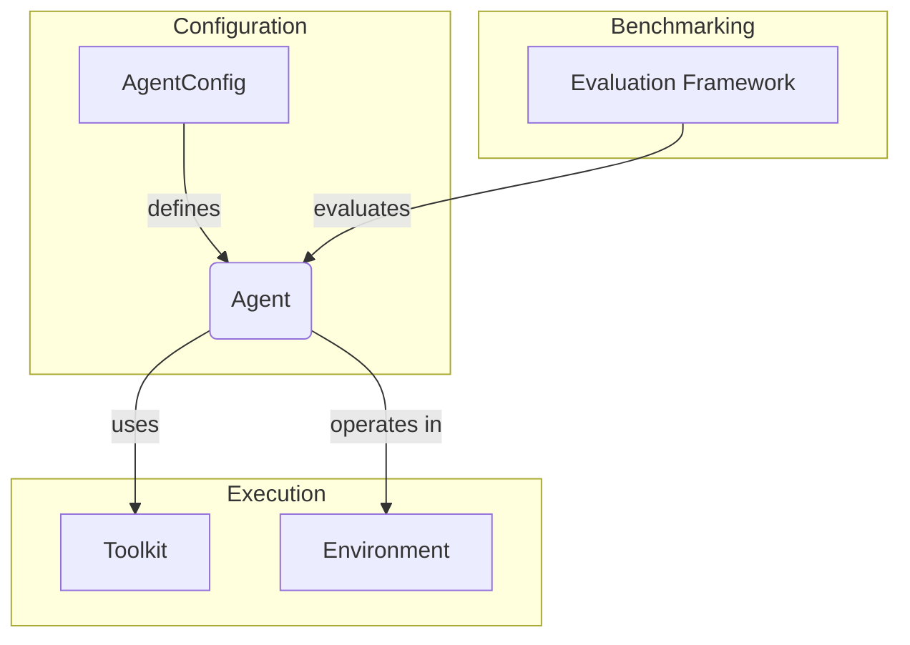

    

    

    Youtu-Agent: A simple yet powerful agent framework that delivers with open-source models
    

    

    
    

# Introduction

Youtu-Agent is a powerful and modular framework for building, running, and evaluating autonomous agents. It is designed with flexibility and extensibility in mind, allowing developers to easily create custom agents, tools, and environments.

The framework's design is centered on a clear separation of concerns, enabling robust and scalable agent development.

Note: Youtu-Agent is abbreviated as `utu` in the code.

## Core Architecture

At a high level, the framework's components interact as follows: An `AgentConfig` defines an `Agent`, which operates within an `Environment` and uses `Toolkits` to perform actions. The entire system can be benchmarked using the `Evaluation Framework`.

## Key Modules

The framework is divided into several key modules, each with a distinct responsibility.

### [Configuration (`config.md`)](./config.md)
The entire framework is driven by a configuration system built on `pydantic` and `hydra`. It uses YAML files to define the behavior of agents, experiments, and their components.

### [Agent Paradigms (`agents.md`)](./agents.md)
The core logic of the agent. The framework supports two primary paradigms:
- **`SimpleAgent`**: A classic single-agent model that reasons and acts in a loop (ReAct-style).
- **`OrchestraAgent`**: A multi-agent system that uses a Plan-and-Execute strategy, coordinating a Planner, Workers, and a Reporter to solve complex tasks.

### [Environments (`env.md`)](./env.md)
Environments represent the world in which an agent operates. They provide state and context to the agent. The framework includes several environments, such as a `ShellLocalEnv` for filesystem access and a `BrowserEnv` for web interaction.

### [Toolkits (`tools.md`)](./tools.md)
Toolkits are collections of tools that grant agents their capabilities. The framework comes with a rich set of pre-built toolkits for web search, file manipulation, code execution, document analysis, and more.

### [Evaluation Framework (`eval.md`)](./eval.md)
A comprehensive framework for benchmarking agent performance. It provides a standardized pipeline for:
1. **Data Management**: Persisting and tracking evaluation data.
2. **Processing**: Standardizing benchmark-specific logic.
3. **Execution**: Running the agent and judging its performance automatically.

## Getting Started

For a step-by-step guide on how to install dependencies, set up your environment, and run your first agent, please see our [**Quickstart Guide**](./quickstart.md).

